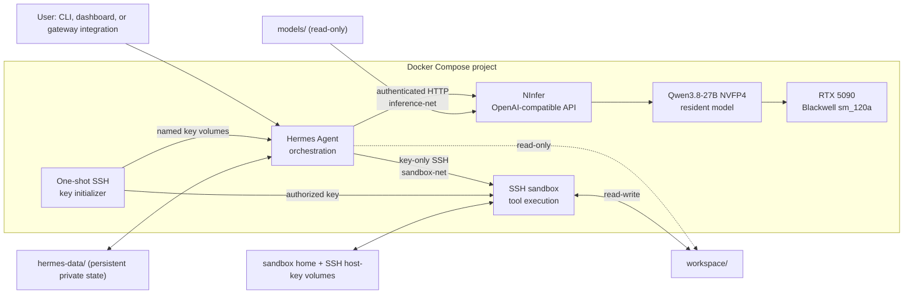

# Hermes + NInfer for RTX 5090

[](LICENSE)
[](docs/compatibility.md)

A reproducible Docker Compose stack for running Hermes Agent with
NInfer-accelerated local inference on NVIDIA RTX 5090 / Blackwell GPUs.

The stack keeps agent orchestration, GPU inference, and tool execution in
separate services. Hermes talks to a pinned NInfer build through an
OpenAI-compatible API, while terminal and file tools run over SSH in a
resource-limited sandbox with no GPU, Docker socket, host port, or outbound
network by default.

> **Status:** `v0.1.0` release candidate. The configuration targets one exact
> NInfer commit and one checksum-pinned Qwen3.8-27B NVFP4 artifact. Normal CI
> validates the repository without GPU hardware; complete inference and tool
> checks run locally with `python stack.py verify`.

## What this repository provides

- Hermes Agent `0.20.5` (`v2026.8.19`) as the persistent orchestrator.
- NInfer pinned to commit
  `feaf4dd0983fdaeb2ba4c06eec6da350e644fb3a` as a Git submodule.
- Qwen3.8-27B NVFP4 in NInfer's version-2 artifact format, downloaded outside
  Git and verified by SHA-256.
- A long-context text profile: 131,072 tokens, INT8 KV, automatic KV sizing,
  concurrency 2, and MTP with three draft tokens.
- A key-only SSH sandbox for terminal, file, and code-execution tools.
- `uv` and `uvx` in the tool sandbox; stack-owned images do not install or use pip.
- Layered health checks, startup ordering, verification, and a local benchmark
  harness that retains auditable raw measurements.
- Public-release safeguards for secrets, runtime state, model weights, logs,
  workspaces, and benchmark output.

This is for an RTX 5090 owner who wants a local, inspectable agent/inference
stack rather than a general-purpose model server. NInfer deliberately targets
a narrow set of checkpoints and `sm_120a`; other GPUs are not supported by
this repository.

## Why Hermes + NInfer

Hermes owns conversations, tool loops, memory, skills, and integrations.
NInfer owns model loading, CUDA execution, token generation, and the inference
API. Keeping that boundary explicit provides three practical benefits:

1. Agent behavior can evolve without coupling it to CUDA/runtime internals.
2. NInfer can be tested directly through a familiar OpenAI-compatible
   contract before Hermes is involved.
3. GPU access remains isolated to the one service that requires it.

Tool execution is separated again: NInfer can return structured tool calls,
but only Hermes decides to dispatch them, and commands run inside the SSH
sandbox rather than the inference or orchestration service.

## Architecture



The inference and sandbox networks are internal. Only Hermes also joins the
normal control network for explicitly configured integrations. NInfer and the
authenticated Hermes dashboard are published only on host loopback
(`127.0.0.1:8080` and `127.0.0.1:9119` by default). Hermes's verification API
remains on container loopback and the sandbox SSH port is never host-published.

See [Architecture](docs/architecture.md) for request flow, storage,
healthchecks, failure behavior, and service ownership. The rationale is in
[Design overview](docs/design-overview.md) and the
[architecture decisions](docs/decisions/).

## Prerequisites

- NVIDIA GeForce RTX 5090 with 32 GiB VRAM.
- A driver capable of running CUDA 13.1 containers.
- 64-bit x86-64 Linux containers through native Docker Engine or Docker
  Desktop. Docker Desktop may use WSL2 internally on Windows, but no WSL shell
  or Linux host tooling is part of this workflow.
- NVIDIA Container Toolkit configured for Docker.
- Docker Engine and Docker Compose 2.17 or newer.
- Python 3.11 or newer and Git. No host Bash, PowerShell, `pip`, `uv`, `curl`,
  `jq`, or `make` installation is required.
- At least 24 GiB free in the model filesystem for the 20.02 GiB artifact and
  staging, plus separate Docker storage for CUDA images and build layers.

NInfer's upstream Dockerfile uses CUDA 13.1.2 on Ubuntu 24.04 and compiles only
for `sm_120a`. A successful host `nvidia-smi` is not enough; confirm Docker can
see the GPU:

```bash
docker run --rm --gpus all \
  nvidia/cuda:13.1.2-base-ubuntu24.04 \
  nvidia-smi
```

Exact inspected versions and the limits of that evidence are recorded in
[Compatibility](docs/compatibility.md).

## Quick start

```bash
git clone https://github.com/joelfourhman/hermes_ninfer_stack.git hermes-ninfer-stack
cd hermes-ninfer-stack

# Complete interactive first run: local state, explicit model-download consent,
# image builds, Hermes wizard, managed configuration, and service startup.
python stack.py setup

# Open the authenticated local dashboard after setup completes.
python stack.py gui
python stack.py verify
```

`python stack.py setup` initializes NInfer when the initial clone omitted
`--recurse-submodules`. It creates `.env` from `.env.example`, generates
independent API and dashboard secrets, and copies `hermes/config.example.yaml` to the
ignored live state only when no live configuration exists. It then asks before
downloading the 20.02 GiB model. Declining is safe: setup pauses without downloading,
and the same command resumes later.

After explicit consent, setup uses an isolated Compose utility image based on the
official version-pinned `uv` image, verifies the model checksum, builds the stack,
runs the Hermes wizard, restores the reviewed NInfer and SSH-sandbox fields, and
starts all services. Nothing is installed into the host Python environment. CI and
normal image builds never download the model.

Use these Hermes wizard choices for the default local stack:

1. **Blank Slate**
2. **ninfer (currently active)**
3. **qwen-local**
4. **Keep current (ssh)**
5. **Start with everything disabled — finish now**

The wizard's final “no inference provider” warning is expected in Blank Slate mode.
The setup command automatically restores the pinned provider immediately afterward.
Choose the extended configuration walk-through only when intentionally enabling a
messaging integration or optional tool; setup still preserves the stack-managed
provider and terminal settings.

The complete first-run sequence, including WSL2 notes and failure recovery, is
in [Installation](docs/installation.md).

## Model profile

| Field | Tested value |
|---|---|
| Model | Qwen3.8-27B |
| Artifact | `qwen3_8_27b_nvfp4.ninfer` (container v2) |
| Quantization | NVFP4 with mixed FP8 resources |
| Size | 21,492,695,040 bytes (20.02 GiB) |
| SHA-256 | `bb3360522a06e136e0367f5703414d26272b7285c8a6ab6194135c17dbd81b32` |
| Deployment model ID | `qwen-local` |
| Context ceiling | 131,072 tokens |
| KV cache | INT8, automatically sized |
| Speculation | MTP, three draft tokens, optimized proposal head |
| Vision | Disabled by this stack |

The artifact contains multimodal resources, but this deployment omits
NInfer's `--vision` flag and tells Hermes that the model is text-only. That
preserves VRAM for the long-context profile; it is a runtime choice, not a
claim that the artifact lacks vision data.

See [Models](docs/models.md) for the pinned Hugging Face revision, replacement
rules, native artifact identity, and the model-ID consistency contract.

## Verification

```bash
python stack.py verify
```

The verifier stops at the first broken boundary, prints a likely diagnostic,
and exits non-zero. Its eleven layers cover:

1. host prerequisites and configuration;
2. Compose resolution and the NInfer source pin;
3. Docker daemon access;
4. NVIDIA runtime registration;
5. NInfer running-image revision/base provenance and RTX 5090 passthrough;
6. model presence and SHA-256;
7. NInfer application health;
8. authenticated `/v1/models` and direct chat completion;
9. Hermes health, configuration, DNS, and authenticated NInfer access;
10. a complete Hermes-to-NInfer generation; and
11. a real SSH-sandbox command verified by its workspace side effect.

Static validation is separate and requires no GPU or model:

```bash
python3 scripts/validate.py
docker compose --env-file .env config --quiet
```

GitHub Actions runs static checks and builds only the sandbox image. It does
not build NInfer, download weights, or present CI as a GPU integration test.

## Example use

Run a one-shot Hermes request inside the active orchestrator container:

```bash
docker compose exec hermes \
  hermes chat -q "Inspect /workspace and summarize the project structure."
```

For an interactive terminal session:

```bash
docker compose exec -it hermes hermes chat
```

The cross-platform control command opens Bash *inside* the running Hermes
container without requiring Bash on the host:

```text
python stack.py shell
```

Hermes's authenticated web dashboard is published only on host loopback:

```text
python stack.py gui
```

This starts Hermes if needed, opens `http://127.0.0.1:9119`, and prints the
generated local username and password. Use `--no-open` on a headless host.

The first-run wizard inside `python stack.py setup` can also configure an intentional gateway such
as Telegram, Discord, or another supported Hermes integration. No gateway
listener is published by this stack; the dashboard is the only Hermes host
port. Tool commands see `/workspace` through the
SSH sandbox; Hermes itself mounts that path read-only.

## Configuration

The supported tuning surface lives in the ignored `.env`:

| Variable | Default | Purpose |
|---|---:|---|
| `NINFER_HOST_PORT` | `8080` | Host-loopback diagnostics only |
| `NINFER_GPU_DEVICE` | `0` | One RTX 5090 device ID |
| `NINFER_MODEL_FILE` | `qwen3_8_27b_nvfp4.ninfer` | Basename under `models/` |
| `NINFER_MODEL_ID` | `qwen-local` | Shared HTTP/Hermes alias |
| `NINFER_CONTEXT_LENGTH` | `131072` | Shared NInfer/Hermes context limit |
| `NINFER_MAX_CONCURRENCY` | `2` | Startup-fixed active requests |
| `HERMES_*`, `SANDBOX_*` limits | see `.env.example` | CPU, memory, PID, UID/GID controls |

Changing the model ID or context requires reapplying Hermes configuration:

```bash
docker compose stop hermes
python stack.py configure-hermes
docker compose up -d --force-recreate ninfer hermes
python stack.py verify
```

Do not change Hermes's internal endpoint to `localhost`; inside its container,
the correct provider URL is always `http://ninfer:8080/v1`. See
[Configuration](docs/configuration.md) for coupled values and safe update
procedures.

## Routine operation

```bash
python stack.py build
python stack.py up
python stack.py status
python stack.py logs
python stack.py shell
python stack.py shell ninfer
python stack.py shell sandbox
python stack.py gui
python stack.py repair-sandbox-trust
python stack.py down
```

Normal startup reconciles Hermes's strict SSH trust entry with the sandbox's
persisted public host key before Hermes starts. Use `repair-sandbox-trust` only
after an intentional Docker volume reset or a reported host-key mismatch; it
verifies the persisted key, replaces only `[sandbox]:2222`, and restarts Hermes.

The optional Makefile remains as a convenience for Unix contributors, but it
is not part of the installation or operation contract. `python stack.py down`
preserves all bind-mounted data and named volumes. Do not run `docker compose
down -v` unless deleting the sandbox home and SSH identities is intentional.

## Benchmarking

After full verification passes:

```bash
python stack.py benchmark
python stack.py benchmark --runs 5 --max-tokens 1024
```

The harness records model/configuration metadata, the verified running-image
revision and CUDA base, prompt and completion token counts, finish reasons,
client-observed streaming TTFT, generation throughput, sampled GPU utilization,
peak VRAM, driver, and Docker versions. Raw SSE timing, GPU samples, prompts,
responses, and NInfer logs stay under ignored `benchmarks/` for review.

No benchmark is fabricated or inferred from service health. The
[Performance guide](docs/performance.md) clearly separates local results from
published upstream NInfer results for the same artifact.

## Security

This is a tool-capable autonomous agent stack, not a security boundary for
untrusted multi-tenant workloads. Docker reduces exposure; it does not make
model output or generated commands trustworthy.

Notable controls:

- no privileged mode, host networking, Docker socket, or broad host mount;
- GPU access only for NInfer;
- host publication only for NInfer and the authenticated Hermes dashboard,
  both on loopback;
- separate internal inference and sandbox networks;
- read-only Hermes view of the workspace;
- key-only, unprivileged SSH sandbox with a read-only root filesystem,
  resource limits, dropped capabilities, and no default egress;
- live Hermes state, model files, workspace content, logs, keys, and benchmark
  responses excluded from Git.

Residual risks include prompt injection, malicious content, agent-generated
commands, writable workspace and persistent sandbox-home damage, orchestrator
egress, provider/plugin supply chains, secrets visible to local Docker
administrators, and persistence shared across Hermes sessions. Review
[Security](docs/security.md) before enabling integrations or processing
untrusted content. Report vulnerabilities according to [SECURITY.md](SECURITY.md).

## Updating

Hermes, NInfer, and the model artifact are independent reviewed inputs:

- Change the digest-pinned `HERMES_IMAGE` only after reviewing a stable release,
  then pull and recreate Hermes.
- Update NInfer through the submodule, inspect upstream changes and serving
  flags, record the new gitlink, rebuild, and re-run all local checks.
- Replace the model only with a NInfer-registered artifact compatible with the
  pinned runtime; update filename, provenance, checksum, model metadata, and
  verification together.

Never use a moving `latest` tag as a silent upgrade. Detailed procedures are
in [Configuration](docs/configuration.md) and [Models](docs/models.md).

## Troubleshooting

Start by locating the failed verifier layer. Common diagnostics are:

```bash
docker compose ps
docker compose logs --tail=200 ninfer
docker compose logs --tail=200 hermes
docker compose logs --tail=100 sandbox
docker compose --env-file .env config --quiet
```

The [Troubleshooting guide](docs/troubleshooting.md) covers GPU/runtime
visibility, Blackwell build failures, OOM and context sizing, model loading and
permissions, port conflicts, `/v1/models`, container DNS, `localhost` mistakes,
model-ID mismatch, malformed tool calls, SSH failures, and restart loops using
Symptom / Likely cause / Diagnosis / Fix sections.

## Known limits

- One RTX 5090, one CUDA device, and one resident NInfer model.
- No multi-GPU sharding, CPU/GPU offload, distributed serving, or generic model
  compatibility.
- The sandbox is shared across sessions in one Compose project; it is not a
  per-request micro-VM.
- Sandbox package/download clients have no egress unless the operator changes
  network policy deliberately.
- Orchestrator-side plugins, hooks, MCP processes, and integrations execute in
  Hermes's boundary, not in the SSH sandbox.
- Vision is disabled in the default long-context profile.

## Documentation

- [Installation](docs/installation.md)
- [Architecture](docs/architecture.md)
- [Design overview](docs/design-overview.md)
- [Configuration](docs/configuration.md)
- [Models](docs/models.md)
- [Troubleshooting](docs/troubleshooting.md)
- [Security model](docs/security.md)
- [Performance](docs/performance.md)
- [Compatibility](docs/compatibility.md)
- [Architecture decisions](docs/decisions/)
- [Contributing](CONTRIBUTING.md)
- [Changelog](CHANGELOG.md)

## Acknowledgements

This stack integrates [Hermes Agent](https://github.com/NousResearch/hermes-agent)
from Nous Research, [NInfer](https://github.com/Neroued/ninfer), and
[Qwen3.8-27B](https://huggingface.co/Qwen/Qwen3.8-27B). NInfer remains an
upstream-owned Apache-2.0 submodule with its bundled third-party license files;
Hermes Agent is MIT-licensed; the selected model artifact and its upstream
sources declare Apache-2.0 licensing.

Stack-authored files are licensed under the [Apache License 2.0](LICENSE).
Dependencies, container images, and model artifacts retain their own licenses
and usage terms.
