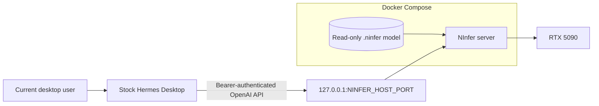

# NInfer for stock Hermes Desktop on RTX 5090

This project is the shortest supported path from a Windows PC with an RTX 5090
to a working local Hermes Desktop chat. You do not need to know how AI models,
CUDA, Docker Compose, or API keys work. Install the four normal prerequisites,
clone the repository, and run one Python command.

The setup order is intentional: it gets the local AI model running first and
then installs and connects Hermes Desktop. When Hermes opens at the end, it has
a working local model to talk to.

## Windows quick start for first-time users

### 1. Install these once

Use the normal graphical installers. Restart Windows if an installer asks you
to.

1. Install the latest driver for the RTX 5090 from the
   [official NVIDIA driver page](https://www.nvidia.com/en-us/drivers/). You do
   **not** need to install the CUDA Toolkit.
2. Install [Docker Desktop for Windows](https://docs.docker.com/desktop/setup/install/windows-install/).
   Keep its recommended Linux-container backend. Open Docker Desktop, accept
   its terms if appropriate for your use, and then close it if you want. Setup
   starts it when needed. Docker may manage WSL 2 internally; you never need to
   open WSL.
3. Install [Git for Windows](https://git-scm.com/download/win) with its normal
   defaults.
4. Install 64-bit [Python for Windows](https://www.python.org/downloads/windows/),
   version 3.10 or newer. Enable the installer's option to add Python to
   `PATH` if it offers one.

Setup offers two pinned model profiles. The recommended **stock** profile
downloads a verified, ready-to-run 20.02 GiB NInfer artifact and needs about
24 GiB free. The optional **uncensored** profile downloads a verified,
ready-to-run 16.96 GiB artifact and needs about 21 GiB free. Docker also needs
separate image space.

### 2. Clone and run the one-command setup

Do not run Command Prompt as Administrator. Press the Windows key, type
**Command Prompt**, open it, and paste these three lines:

```text
git clone https://github.com/joelfourhman/hermes_ninfer_stack.git hermes-ninfer-stack
cd hermes-ninfer-stack
python ninfer.py setup
```

Then follow these exact prompts:

1. At the model menu, press Enter for **Stock Qwen3.8-27B (recommended)**, or
   enter `2` for **Qwen3.8-27B Uncensored**. Setup explains the storage and
   behavior tradeoff before anything large is downloaded.
2. Setup checks Python, Git, disk space, the RTX 5090, and Docker. If Docker
   Desktop is installed but stopped, setup opens it and waits for it.
3. At the model download prompt, press Enter. Leave Command Prompt open while
   the selected artifact is downloaded, verified, and loaded.
   Interrupted downloads are reusable, so rerunning setup does not start over.
   Setup requires a short authenticated test answer before continuing.
4. At **Install and configure stock Hermes Desktop now? [Y/n]**, just press
   Enter. The default answer is yes.
5. The official Hermes Desktop page opens. Download the Windows installer from
   that page and complete its normal per-user installation.
6. Launch Hermes once if the installer does not launch it. If Hermes asks you
   to choose an AI provider, select **Choose provider later**. You do not need
   a Nous Portal account or a cloud-provider API key for this local setup.
7. Finish the first-launch screens, return to the still-open Command Prompt,
   and press Enter when the helper asks.
8. After it configures Hermes, the helper asks you to close Hermes and press
   Enter once more. It then reopens Hermes automatically when possible.
9. Wait for **SETUP COMPLETE**, then begin a new chat in Hermes. Before
   allowing file or command actions, read the security warning below: native
   Hermes has your normal user access.

There is no project username or password, and you do not need a Hugging Face
account. The helper creates the private local connection key and gives it to
Hermes without displaying it.

If the window was closed or the Hermes step did not finish, do not start over.
Reopen Command Prompt in the repository directory and run:

```text
python ninfer.py install-hermes
```

The helper starts Docker Desktop and the configured model service if needed.

For a click-by-click walkthrough and common first-run problems, see the
[beginner installation guide](docs/installation.md).

## What is installed

This project runs one Docker container: NInfer, the program that loads the AI
model on the RTX 5090. A normal, native installation of
[Hermes Desktop](https://hermes-agent.nousresearch.com/desktop) connects to it
only through this PC's private loopback address.

Hermes is not packaged, forked, or run in Docker by this repository. It runs as
the signed-in desktop user and keeps its configuration, sessions, skills, and
updates in the standard Hermes locations.

> **Security boundary:** native Hermes has the same filesystem permissions as
> the user who launches it. A UAC prompt, approval dialog, or Hermes safe-root
> setting is not a filesystem sandbox. Review tool calls and use backups or a
> separate OS account when stronger isolation is required.

## What the project provides

- A pinned NInfer source revision built for the RTX 5090 (`sm_120a`).
- Two fixed, checksum-verified model downloads: stock Qwen3.8-27B NVFP4 and
  Qwen3.8-27B Uncensored groupwise-int.
- An interactive first-run choice and a safe `select-model` command that retain
  both artifacts and restore the previous profile if the new one cannot start.
- Three reviewed RTX 5090 runtime profiles, with a balanced two-request agent
  profile selected automatically for first-time users.
- An authenticated OpenAI-compatible endpoint published only at
  `127.0.0.1:${NINFER_HOST_PORT}`.
- A single Python control command, `ninfer.py`, for setup, operation,
  verification, performance diagnosis, and benchmarking.
- A helper that finds or directs the user to the official Hermes Desktop
  installer and configures the stock installation for NInfer.

The helper is not a custom installer and this repository does not produce a
Hermes executable. The official Hermes installer remains responsible for the
desktop application and its runtime dependencies.

## Architecture



NInfer owns model loading, GPU memory, tokenization, and generation. Hermes
owns the agent loop, native tools, memory, skills, and integrations. They meet
only at the authenticated OpenAI-compatible HTTP boundary.

See [Architecture](docs/architecture.md) for the full trust and data flow.

## Requirements

- NVIDIA GeForce RTX 5090 with enough free VRAM for the selected profile.
- A driver capable of running CUDA 13.1 containers.
- Docker Desktop or Docker Engine with NVIDIA GPU support and Docker Compose.
- Git and Python 3.10 or newer on the host.
- At least 24 GiB free for stock, or 21 GiB for uncensored. Keeping both final
  artifacts uses about 37 GiB.
- Network access during initial source, model, and Hermes Desktop installation.

On Windows, use Linux containers in Docker Desktop. This project does not
require the user to install or work inside WSL, Bash, or a Linux shell. The
stock Hermes Windows installer may provision its own upstream-managed runtime
dependencies, including PortableGit, as described by the
[official Windows guide](https://hermes-agent.nousresearch.com/docs/user-guide/windows-native).
That upstream installer currently invokes a PowerShell bootstrap internally.
You do not need to open or script PowerShell yourself, and this project never
does so, but a literal policy that forbids any PowerShell or Bash process on the
host is not compatible with the current stock Windows Hermes distribution.

## What the setup command does

`python ninfer.py setup` asks which pinned model profile to use, initializes the
exact NInfer source and the balanced runtime profile, safely migrates obsolete
local settings, asks before the large transfer,
downloads and verifies the selected model in a short-lived CPU-only container,
starts NInfer, waits for a real answer, and then offers the official
stock Hermes Desktop installation. It is safe to rerun after an interruption.
The host installs no Python packages; container tools use committed uv locks.

## Install or repair Hermes separately

NInfer can be prepared before Hermes Desktop is installed. Once NInfer is
healthy, run:

```text
python ninfer.py install-hermes
```

The helper:

- detects the normal `hermes` command and the standard Windows per-user
  installation path;
- opens the [official Hermes Desktop download page](https://hermes-agent.nousresearch.com/desktop)
  when the stock installation is missing;
- waits for the user to finish that installer instead of substituting a custom
  package;
- stores the NInfer bearer key in Hermes's normal secret file;
- creates or updates the named `ninfer` provider and selected model, then
  applies the documented session and approval defaults;
- keeps the native terminal backend and stock working-directory behavior;
- removes this project's former `workspace/` and `HERMES_WRITE_SAFE_ROOT`
  overrides while retaining stock protected-path checks;
- sets command approvals to `manual` so flagged commands require the user's
  decision instead of an auxiliary model's automatic approval;
- runs Hermes's own configuration check.

It is safe to rerun after a Hermes reinstall, NInfer port change, model alias
change, or key rotation. Existing unrelated Hermes providers, sessions, tools,
and preferences are preserved; the documented compression, turn-cap, and
manual-approval settings are intentionally applied.

After configuration, the helper asks you to close Hermes so it can reload the
new provider, then reopens it automatically when possible. If it cannot reopen
the app, launch **Hermes** normally from the Start menu or the platform's
application launcher.

There is no project dashboard username or password in this architecture.
Hermes Desktop runs as the signed-in OS user; the NInfer bearer key is stored
privately and is not an interactive login credential.

## Hermes settings

The helper applies the equivalent of these stock Hermes settings:

```yaml
providers:
  ninfer:
    api: http://127.0.0.1:8080/v1
    key_env: NINFER_API_KEY
    transport: chat_completions
    default_model: qwen-local
    models:
      qwen-local:
        context_length: 131072
        supports_vision: false

model:
  provider: custom:ninfer
  default: qwen-local
  context_length: 131072
  supports_vision: false

terminal:
  backend: local

approvals:
  mode: manual

compression:
  enabled: true
  threshold: 0.9
  threshold_tokens: 90000
```

The actual port comes from `NINFER_HOST_PORT`; it is not assumed to be 8080.
The API key is not written inline in `config.yaml` and is never printed by the
helper. The helper removes its older `terminal.cwd` and
`HERMES_WRITE_SAFE_ROOT` overrides. Desktop follows stock Hermes behavior:
Desktop/gateway tools begin in the user's home directory, while CLI sessions
use the directory where Hermes was launched. Hermes's built-in credential and
protected-path denylist remains active.

## Model profiles

| Profile | Stock (default) | Uncensored (optional) |
| --- | --- | --- |
| Download | `neroued/Qwen3.8-27B-nvfp4-NInfer` | `DogOnKeyboard/Qwen3.8-27B-Uncensored-NInfer` |
| Artifact | `qwen3_8_27b_nvfp4.ninfer` | `qwen3_8_27b_uncensored.ninfer` |
| Preparation | Verified 20.02 GiB download | Verified 16.96 GiB download |
| Quantization | NVFP4 | NInfer `qwen3_8_27b-v1` groupwise-int |
| Behavior | Stock model behavior; recommended | Reduced refusal behavior; use deliberately |

Model choice and runtime tuning are independent. Fresh setup uses `balanced`:

| Runtime | Context | Shared device KV | Lanes | Hermes compression | Use case |
| --- | ---: | ---: | ---: | ---: | --- |
| `balanced` (default) | 131,072 | 196,608 | 2 | 90,000 | Long AFK task plus a smaller interactive request |
| `single-session` | 131,072 | 131,072 | 1 | 100,000 | One isolated request with the smallest device allocation |
| `max-context` | 240,000 | 240,000 | 2 | 200,000 | Very large histories; slower prompt ingestion |

All profiles use FP8 KV, a 1,024-token prefill chunk, MTP with three draft
tokens, CUDA Graphs, prefix reuse, retained thinking, and bounded device/host
checkpoint caches. Vision remains disabled. Switch safely with
`python ninfer.py select-runtime`; the command restarts NInfer, runs a real
answer test, rolls back on failure, and updates stock Hermes when installed.
See [Models](docs/models.md) and [Performance](docs/performance.md).

For the recommended Frogue Gallery configuration, use these exact commands:

```text
python ninfer.py select-model --model stock
python ninfer.py select-runtime --profile balanced
python ninfer.py verify
```

Model selection uses `--model`; runtime selection uses `--profile`. Close and
reopen Hermes Desktop after switching so it reloads the updated provider
metadata.

> **Model behavior is not a safety boundary.** For the uncensored profile, its publisher measured
> substantially fewer refusals on harmful prompts, not zero refusals, and did
> not evaluate code, math, generative quality, vision, or MTP behavior. Manual
> approvals and filesystem backups matter more with this model, not less.

## Verification

Run the layered local verifier after setup:

```text
python ninfer.py verify
```

The verifier checks the pinned source and image provenance, GPU visibility,
model checksum, NInfer health, loopback authentication, model discovery, and a
real generation. When stock Hermes is installed, it also checks the native
provider configuration and the Hermes-to-NInfer route.

Hardware-independent repository checks remain available as:

```text
python ninfer.py validate
```

## Routine operation

```text
python ninfer.py prepare-model
python ninfer.py select-model
python ninfer.py select-runtime
python ninfer.py build
python ninfer.py up
python ninfer.py status
python ninfer.py logs
python ninfer.py shell
python ninfer.py verify
python ninfer.py diagnose-performance
python ninfer.py down
```

`prepare-model` prepares the currently configured profile (or one named with
`--model stock|uncensored`). `select-model` displays the same two choices,
prepares the selection if necessary, starts it, and restores the previous
profile if the live test fails. Both model files are retained.
`select-runtime` chooses one of the reviewed memory/performance profiles without
changing or redownloading the model. For non-interactive selection, use
`select-model --model stock|uncensored` and
`select-runtime --profile balanced|single-session|max-context`; the option
names are intentionally different.
`down` stops NInfer without removing the downloaded model. The model is a host
file mounted read-only into the container.
`shell` opens Bash inside the NInfer container; it does not install or invoke a
host Bash environment.

After verification passes, collect direct NInfer measurements with:

```text
python ninfer.py benchmark
python ninfer.py benchmark --runs 5 --max-tokens 1024
```

To summarize recent private NInfer counters without printing prompts or model
responses, run `python ninfer.py diagnose-performance`.

## Configuration

`python ninfer.py setup` creates the ignored `.env` file from `.env.example`
and generates a random NInfer bearer key. The main settings are:

| Variable | Default | Purpose |
| --- | --- | --- |
| `NINFER_HOST_PORT` | `8080` | Host-loopback endpoint port |
| `NINFER_GPU_DEVICE` | detected (`0` normally) | NVIDIA device reserved for NInfer |
| `NINFER_MODEL_PROFILE` | `stock` | Fixed profile: `stock` or `uncensored` |
| `NINFER_MODEL_FILE` | `qwen3_8_27b_nvfp4.ninfer` | Profile-controlled artifact mounted read-only |
| `NINFER_MODEL_ID` | `qwen-local` | API alias configured in Hermes |
| `NINFER_RUNTIME_PROFILE` | `balanced` | Reviewed runtime profile |
| `NINFER_CONTEXT_LENGTH` | `131072` | Per-request sequence ceiling |
| `NINFER_KV_CAPACITY` | `196608` | Shared device KV-token budget |
| `NINFER_MAX_CONCURRENCY` | `2` | Simultaneous request limit |
| `NINFER_PENDING_TIMEOUT_MS` | `120000` | Preparation and admission deadline |
| `NINFER_KV_DTYPE` | `fp8` | Device KV storage format |
| `NINFER_HOST_KV_MIB` | `8192` | Pinned host checkpoint KV budget |
| `NINFER_API_KEY` | generated | Bearer key shared with native Hermes |
| `HERMES_COMPRESSION_ENABLED` | `true` | Native Hermes long-session compression |
| `HERMES_COMPRESSION_THRESHOLD_TOKENS` | `90000` | Compress before prompt ingestion dominates latency |
| `HERMES_MAX_TURNS` | `40` | Native Hermes tool-loop turn cap |

Changing the port, model alias, context, or key requires NInfer recreation and
another idempotent Hermes configuration pass:

```text
python ninfer.py down
python ninfer.py up
python ninfer.py install-hermes
python ninfer.py verify
```

See [Configuration](docs/configuration.md) for validation rules and coupling.

## Security notes

- NInfer is bound to `127.0.0.1`, not all host interfaces.
- The API requires the generated bearer key.
- Only NInfer receives the GPU reservation and read-only model mount; both
  container root filesystems are read-only with bounded temporary storage.
- No Docker socket is mounted into the container or exposed to Hermes.
- Hermes runs outside Docker with the current user's normal authority.
- Hermes retains its stock protected-path denylist, but other file and terminal
  actions have the signed-in user's normal access.
- UAC controls elevation; it does not stop a non-elevated Hermes process from
  changing files that the current user can change.
- Hermes approvals and safe-root checks are useful guardrails, not OS-level
  containment.
- Keep important work in version control and maintain backups that Hermes
  cannot silently overwrite.

Read [Security](docs/security.md) before enabling broad native terminal,
browser-control, plugin, cron, or unattended capabilities.

## Project layout

```text
.
├── ninfer.py                  Cross-platform control command
├── docker-compose.yml         NInfer runtime and one-shot download profile
├── .env.example               Supported non-secret defaults
├── ninfer/                    Pinned NInfer source submodule
├── model-downloader/          uv-locked, checksum-verifying model downloader
├── models/                    Ignored local model storage
├── scripts/                   Validation, verification, and benchmark helpers
├── benchmarks/                Ignored benchmark result directories
└── docs/                      Architecture and operating guidance
```

## Documentation

- [Installation](docs/installation.md)
- [Architecture](docs/architecture.md)
- [Configuration](docs/configuration.md)
- [Models](docs/models.md)
- [Compatibility](docs/compatibility.md)
- [Performance](docs/performance.md)
- [Security](docs/security.md)
- [Troubleshooting](docs/troubleshooting.md)
- [Design overview](docs/design-overview.md)

## License and upstream projects

Repository integration code is licensed under Apache License 2.0. NInfer,
Hermes Agent, model artifacts, CUDA components, container bases, and downloaded
dependencies retain their own licenses and terms. Review them before
redistribution or commercial deployment.
