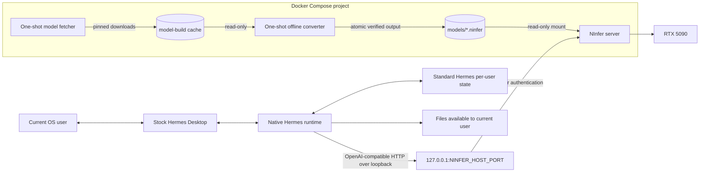

# Architecture

## Scope

This repository operates NInfer as the only long-running Docker service and
connects an independently installed, stock Hermes Desktop application to it.
The design deliberately separates deployment ownership:

- this repository owns the NInfer build, model artifact, endpoint, and API key;
- the official Hermes installer owns Hermes Desktop and the native Hermes
  runtime;
- the current desktop user owns Hermes state, sessions, skills, tools, and
  integrations.

There is no Hermes image, project dashboard, SSH tool sandbox, or custom desktop
installer in the active architecture.

## Component diagram



## Responsibilities

| Component | Owns | Does not own |
| --- | --- | --- |
| `ninfer.py` | First-run coordination, model consent, Compose lifecycle, stock Hermes discovery, and narrow provider configuration | Hermes packaging, Hermes updates, desktop UI, or agent policy |
| NInfer container | Artifact validation, model loading, GPU memory, tokenization, generation, and the OpenAI-compatible API | Agent state, tool execution, filesystem work, or Hermes configuration |
| Model fetcher | Explicit, resumable acquisition and source/frontend verification | GPU access, model serving, or Hermes installation |
| Model converter | Network-disabled groupwise-int conversion, report validation, and local checksum manifest | Source downloads, normal serving, or Hermes state |
| Stock Hermes Desktop/runtime | Conversations, tool loop, memory, skills, integrations, and native tool execution | CUDA model execution or Docker lifecycle |
| Docker Desktop/Engine | NInfer process isolation, GPU assignment, port publication, and restart policy | Confining the native Hermes process |

NInfer can return structured tool calls but never executes them. Native Hermes
decides whether to dispatch a tool and performs it with the authority of the
user running Hermes.

## Request flow

1. The user sends a message in stock Hermes Desktop.
2. The Desktop application sends it to its normal local Hermes runtime.
3. Hermes selects `custom:ninfer` and reads `NINFER_API_KEY` from its standard
   secret file.
4. Hermes calls
   `http://127.0.0.1:${NINFER_HOST_PORT}/v1/chat/completions` with the configured
   model alias.
5. Docker forwards the loopback-bound host port to NInfer's fixed container
   port 8080.
6. NInfer authenticates the request, generates on the RTX 5090, and returns the
   OpenAI-compatible response.
7. Hermes either presents the response or performs an approved native tool
   call and submits the resulting tool output in another model turn.

Direct diagnostics use the same host endpoint and intentionally bypass Hermes
so inference problems can be separated from provider or agent problems.

## Network boundary

NInfer listens on port 8080 inside its container. Compose publishes it as:

```text
127.0.0.1:${NINFER_HOST_PORT} -> ninfer:8080
```

Binding to `127.0.0.1` prevents ordinary LAN access, but local processes owned
by any account permitted to connect to loopback can reach the socket. Bearer
authentication remains required. The helper configures Hermes with the host
address, never the former container-only hostname `ninfer`.

NInfer does not need a Docker network shared with Hermes because Hermes is not
in Docker. No relay container is required, and no Docker socket is exposed to
Hermes. The bridge is intentionally not marked `internal`: Docker Desktop does
not connect internal networks to host interfaces, so doing so silently defeats
the required loopback publication on Windows. This means NInfer can initiate
ordinary outbound connections through Docker's bridge. Its host access remains
limited to the read-only model bind mount and selected GPU.

## Configuration boundary

The project generates `.env` from `.env.example`. It contains the NInfer model,
memory, port, device, and bearer-key values used by Compose.

The Hermes helper uses stock Hermes configuration commands to create or update
one named provider:

```yaml
providers:
  ninfer:
    api: http://127.0.0.1:8080/v1
    key_env: NINFER_API_KEY
    transport: chat_completions
    default_model: qwen-local
```

It then selects `model.provider: custom:ninfer`, applies the matching model ID
and context metadata, and lets Hermes validate its own files. The secret is
stored through Hermes's supported secret writer rather than embedded in the
provider YAML. Other Hermes providers and preferences are not replaced.

Hermes's per-user data location is controlled by the upstream installation. On
native Windows the official default is `%LOCALAPPDATA%\hermes`; other platforms
use the standard locations documented by Hermes. This repository does not bind
mount or own those directories.

## GPU and model boundary

Only NInfer receives the NVIDIA device reservation. Its source build targets
Blackwell `sm_120a`, and the selected artifact is mounted read-only from
`./models`.

The source revision, artifact filename, artifact checksum, public model alias,
context, KV capacity, concurrency, prefill chunk, and speculative settings form
one reviewed compatibility profile. Changing one can affect both correctness
and VRAM use. The public alias and context also have to be reapplied to Hermes
with `python ninfer.py install-hermes`.

## Startup and recovery

The normal first run is:

```text
python ninfer.py setup
```

Setup initializes local configuration, offers the verified stock artifact or
the optional uncensored local build, and asks before either large transfer. It
downloads or builds and atomically verifies the selection, starts NInfer, and
waits for a real answer before offering Hermes Desktop configuration. This
ordering ensures Hermes is pointed at a reachable endpoint and an incomplete
artifact is never selected.

The two lifecycles remain independent after setup:

- Docker restart policy keeps NInfer available across container-engine
  restarts.
- The official Hermes installer and updater manage Hermes Desktop.
- `python ninfer.py install-hermes` repairs the integration settings and
  reapplies the documented compression, turn-cap, and manual-approval defaults.
- `python ninfer.py down` stops NInfer without deleting the model or Hermes
  state.

A healthy container proves only that `/health` answers. Verification also
checks authentication, model discovery, and generation. If Hermes is installed,
the native route is checked separately.

## Data and persistence

| Data | Location | Persistence and access |
| --- | --- | --- |
| Project configuration | `.env` | Ignored host file; used by Compose and `ninfer.py` |
| Model artifact | `models/` | Ignored host file; read-only inside NInfer |
| Source checkpoint and converter cache | `model-build/` | Ignored, resumable host data; writable only by the fetcher and read-only to the converter |
| Local model provenance | `models/*.local-manifest.json` | Ignored checksum and pinned-input identity used by verification |
| NInfer image | Docker image store | Rebuildable from the pinned source and base |
| Hermes config and secret | Standard per-user Hermes home | Owned and migrated by stock Hermes |
| Hermes sessions, skills, memory, logs | Standard per-user Hermes home | Independent of Docker and this repository |
| Benchmark output | `benchmarks/` | Ignored host results |

Removing the NInfer container does not remove the built model, build cache, or native
Hermes data. Uninstalling Hermes follows the official Hermes lifecycle and is
not performed by this project.

## Trust model

The container boundary limits NInfer: it receives the GPU and model file, but
not arbitrary host directories or the Docker socket. It does not limit native
Hermes.

Hermes executes as the signed-in user. Therefore:

- every file writable by that user is potentially writable by Hermes tools;
- UAC prevents unapproved elevation but is not a same-user filesystem sandbox;
- a Hermes approval prompt is a product guardrail, not a kernel boundary;
- version control, offline or separately protected backups, and an optional
  dedicated OS account provide stronger protection than prompt policy alone.

See [Security](security.md) for the operational consequences.

## Decisions

- [ADR 0005: Stock native Hermes Desktop](decisions/0005-stock-native-hermes-desktop.md)
  defines the active deployment boundary.
- [ADR 0001: Separate agent and inference services](decisions/0001-separate-agent-and-inference-services.md)
  is retained as historical context and superseded in its Compose-specific
  details by the native-Hermes deployment.
- [ADR 0002: OpenAI-compatible inference boundary](decisions/0002-openai-compatible-inference-boundary.md)
  remains active, with host loopback replacing the old internal network.
- [ADR 0003: External model artifacts](decisions/0003-external-model-artifacts.md)
  remains active.
- [ADR 0004: SSH sandbox boundary](decisions/0004-ssh-sandbox-security-boundary.md)
  is historical and superseded; the active project has no SSH sandbox.
- [ADR 0005: Stock native Hermes Desktop](decisions/0005-stock-native-hermes-desktop.md)
  records the active deployment decision.
