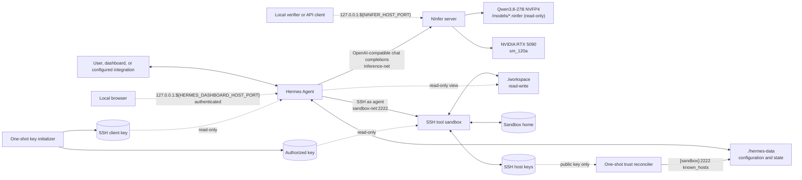

# Architecture

This repository packages Hermes Agent for orchestration, NInfer for local model serving, an SSH
sandbox for agent-controlled command execution, and networkless one-shot helpers for sandbox key
initialization and host-trust reconciliation into one Docker Compose project. The release profile
is deliberately specialized for one NVIDIA GeForce RTX 5090 and one resident Qwen3.8-27B NVFP4 model.

The stack keeps orchestration, inference, and tool execution in separate trust and resource
boundaries. They communicate through narrow network and filesystem interfaces rather than sharing
processes or broad host access.

## System view

Only NInfer receives a GPU reservation. Only the sandbox receives a writable host workspace. Only
Hermes joins the ordinary egress network.

## Component responsibilities

| Component | Owns | Does not own |
|---|---|---|
| Hermes | Agent loop, conversation state, provider selection, tool selection, integrations, and tool-result feedback | CUDA execution, model weights, or direct host command execution |
| NInfer | Artifact validation and loading, tokenization/template resources embedded in the artifact, GPU memory, generation, and the supported OpenAI-compatible HTTP surface | Agent state, tool execution, or Hermes configuration |
| SSH sandbox | Terminal, file, and code-execution commands requested by Hermes; writable workspace and persistent user home | Model inference, Docker control, GPU access, or unrestricted network access |
| Key initializer | Creation and ownership of the persistent SSH client/authorized-key pair | Long-running service traffic |
| Trust reconciler | Validation and installation of the sandbox's persisted public host key in Hermes `known_hosts` | Network key discovery, private host-key access, or global SSH policy changes |
| Host project | Compose definition, reviewed configuration template, model download workflow, and persistent bind-mount directories | Model weights in Git or live Hermes state in Git |

NInfer may return structured tool calls, but it never executes them. Hermes validates and dispatches
those calls over SSH, records the result, and decides whether another inference turn is needed.

## Request and tool-call flow

1. A user reaches Hermes through a configured gateway integration or another supported Hermes
   entry point.
2. Hermes renders the agent request and sends an authenticated chat-completions request to
   `http://ninfer:8080/v1` on `inference-net`. The public model name is the configurable
   `NINFER_MODEL_ID` alias, `qwen-local` by default.
3. NInfer runs the request against the already-loaded `.ninfer` artifact on the configured RTX 5090
   device. It returns assistant content, reasoning fields, or structured tool calls through the
   same HTTP response.
4. For an ordinary response, Hermes persists the turn and returns it through the active integration.
5. For a terminal, file, or code-execution call, Hermes connects as the unprivileged `agent` user to
   `sandbox:2222`. The sandbox performs the operation with `/workspace` as its working directory.
6. Hermes incorporates the tool result into the conversation and, when needed, submits the next
   request to NInfer.

The local verification workflow also calls NInfer through its loopback-only host publication. That
diagnostic route bypasses Hermes intentionally so failures can be localized to inference, provider
routing, or tool execution.

## Network boundaries

Compose creates three project-scoped bridge networks.

| Network | Members | External routing | Purpose |
|---|---|---|---|
| `inference-net` | Hermes, NInfer | Internal network | Authenticated provider traffic from Hermes to NInfer |
| `sandbox-net` | Hermes, sandbox | Internal network | SSH tool dispatch from Hermes to the sandbox |
| `control-net` | Hermes; one-shot model downloader when its profile is selected | Normal bridge egress | Hermes integrations and explicit artifact acquisition |

The key initializer uses `network_mode: none`. NInfer does not join `control-net`, and the sandbox
does not join it either. The sandbox therefore cannot fetch packages or contact the LAN by default,
even though its image contains common development clients.

NInfer's container port `8080` and Hermes's dashboard port `9119` are bound to host loopback at
`NINFER_HOST_PORT` and `HERMES_DASHBOARD_HOST_PORT`. The dashboard requires its generated basic-auth
credentials. The sandbox SSH port is reachable only from `sandbox-net`. Hermes's separate local API
is enabled on container loopback for health and verification but is not published to the host.

Network placement limits reachability; it does not replace authentication. NInfer requires the
random `NINFER_API_KEY`, and the container-local Hermes API uses the distinct
`HERMES_API_SERVER_KEY`. The dashboard uses another independent password and session-signing secret.

The `model-downloader` profile is not a long-running role. When explicitly invoked, it receives
egress plus a writable `models/` bind, downloads one revision-pinned artifact through a uv-managed
client, verifies its SHA-256 digest, and exits.

## GPU and model ownership

The NInfer service is the sole GPU consumer. Compose reserves the device selected by
`NINFER_GPU_DEVICE`; the NInfer source build is compiled specifically for `sm_120a`. Hermes and the
sandbox receive no GPU device mapping.

The default artifact is `models/qwen3_8_27b_nvfp4.ninfer`, selected through
`NINFER_MODEL_FILE`. It is approximately 20.02 GiB and is mounted at `/models` read-only. The model
download helper pins the Hugging Face revision and verifies the published SHA-256 checksum before
the file is accepted. Model data is never copied into a Docker image or committed to Git.

NInfer itself is a Git submodule pinned to commit
`feaf4dd0983fdaeb2ba4c06eec6da350e644fb3a`. The source pin and artifact checksum are independent:
the former fixes the runtime implementation, while the latter fixes the model container loaded by
that runtime.

The release profile uses:

- a per-request context ceiling from `NINFER_CONTEXT_LENGTH` (`131072` by default);
- automatic shared KV-capacity sizing;
- INT8 KV storage;
- a 1,024-token prefill chunk;
- MTP speculative decoding with three draft tokens and the optimized proposal head; and
- startup-fixed concurrency from `NINFER_MAX_CONCURRENCY` (`2` by default).

The selected artifact contains multimodal resources, but this stack intentionally runs the
long-context text profile without NInfer's `--vision` option. The Hermes template therefore marks
the model as not supporting vision. This avoids reserving the fixed vision allocations and is a
runtime choice, not a claim that the artifact itself is text-only.

## Filesystem and persistence

| Host or named storage | Container consumer | Access | Lifecycle |
|---|---|---|---|
| `./models` | NInfer `/models` | Read-only | User-managed; excluded from Git |
| `./hermes-data` | Hermes `/opt/data` | Read-write | Live config, secrets, sessions, memory, skills, and logs; fully excluded from Git |
| `./hermes-data/.ssh` | Trust reconciler `/hermes-trust` | Read-write | Narrow host-trust update scope; no access to other Hermes state |
| `./workspace` | Sandbox `/workspace` | Read-write | User and agent work; generated content excluded from Git |
| `./workspace` | Hermes `/workspace` | Read-only | Context and path authorization without direct orchestrator writes |
| `sandbox-client-key` | Hermes `/ssh` | Read-only | Docker named volume; survives recreation |
| `sandbox-authorized-key` | Sandbox runtime | Read-only | Docker named volume; survives recreation |
| `sandbox-host-keys` | Sandbox `/etc/ssh/host-keys` | Read-write | Stable SSH host identity |
| `sandbox-host-keys` | Trust reconciler `/sandbox-host-key` | Read-only | Public key source; private key remains mode `0600` |
| `sandbox-home` | Sandbox `/home/agent` | Read-write | Persistent user packages, caches, and shell state |

`hermes/config.example.yaml` is the reviewed, non-secret configuration template. The setup and
configuration scripts materialize the live copy under ignored `hermes-data/`; normal Hermes
migrations and user-specific integration settings therefore cannot dirty or leak through the
tracked template.

Removing containers does not remove bind-mounted data or named volumes. Running
`docker compose down -v` is intentionally not part of normal maintenance because it deletes the
sandbox home and SSH identities.

## Configuration contract

The public environment surface is intentionally small.

| Setting | Purpose |
|---|---|
| `NINFER_API_KEY` | Bearer key shared only by Hermes, NInfer, and local verification |
| `HERMES_API_SERVER_KEY` | Distinct key for Hermes's container-local API |
| `NINFER_HOST_PORT` | Host-loopback port used for direct NInfer diagnostics |
| `NINFER_GPU_DEVICE` | NVIDIA device index reserved for NInfer |
| `NINFER_MODEL_FILE` | Artifact filename inside `./models` |
| `NINFER_MODEL_ID` | HTTP model alias shared by NInfer and Hermes |
| `NINFER_CONTEXT_LENGTH` | Per-request context ceiling shared by NInfer and Hermes metadata |
| `NINFER_MAX_CONCURRENCY` | Startup-fixed request capacity for NInfer |
| `HERMES_IMAGE` | Reviewed Hermes image tag |
| `HERMES_UID`, `HERMES_GID` | Host-compatible ownership for bind mounts and SSH keys |
| Hermes and sandbox CPU, memory, and PID settings | Compose-enforced non-GPU service limits |

Internal ports and service DNS names are fixed implementation contracts. Changing a host-loopback
port does not change Hermes's internal NInfer URL. Model ID and context values must agree at both
ends; the unified setup command automatically applies those values after the Hermes wizard through
Hermes's supported configuration interface instead of relying on hand-edited live YAML.

## Startup and readiness

Startup has two independent branches before Hermes can run:

1. `sandbox-keygen` creates or reuses the SSH client key and publishes its public key. `sandbox`
   starts only after that one-shot service exits successfully. Once the sandbox is healthy,
   `sandbox-trust` validates its persisted ED25519 public host key and replaces only the
   `[sandbox]:2222` entry in Hermes's `known_hosts`; Hermes waits for that one-shot service to finish.
2. NInfer starts independently, validates and loads the artifact, initializes its GPU allocations,
   and then begins serving HTTP.

The sandbox healthcheck requires an installed authorized key, a valid `sshd` configuration, and a
running SSH daemon. NInfer's healthcheck requires an HTTP 200 response from `/health`; its extended
start period accommodates loading the large artifact. Hermes starts only after both services are
healthy. Its healthcheck calls the gateway health endpoint on container loopback.

These dependency conditions govern initial startup. Docker Compose does not continuously restart a
dependent service merely because a dependency later becomes unhealthy. Each long-running service
has its own restart policy, so a later NInfer or sandbox restart may surface as a transient Hermes
provider or tool error until that service recovers.

## Failure behavior

- A missing, unreadable, incompatible, or corrupt model prevents NInfer from becoming healthy;
  Hermes remains blocked during initial startup. The download and verification scripts distinguish
  absence from checksum failure before inference is attempted.
- Failure of the key initializer prevents the sandbox from starting. Missing keys or invalid SSH
  configuration keep the sandbox unhealthy and therefore block Hermes startup.
- If NInfer runs out of GPU memory, it exits or fails startup rather than silently changing the
  context profile. Lowering concurrency or context is an explicit configuration change that must be
  applied consistently to Hermes.
- Bind-mounted Hermes and workspace state, plus the named SSH volumes, survive container restart or
  recreation. A failed upgrade can therefore be investigated without losing state.
- The layered verifier checks Docker, GPU visibility, artifact integrity, NInfer health and API,
  Hermes-to-NInfer routing, and a real SSH-backed tool side effect. It reports the first failed
  boundary rather than treating a running container as proof of readiness.

## Security boundaries and limits

The stack avoids privileged containers, host networking, the Docker socket, broad host filesystem
mounts, and GPU access outside NInfer. The sandbox drops capabilities, enables
`no-new-privileges`, uses key-only SSH for an unprivileged user, applies CPU/memory/PID limits, and
runs with a read-only root filesystem plus bounded temporary filesystems.

These controls reduce blast radius; they do not make generated commands trustworthy. The sandbox
can modify the shared workspace and its persistent home, and it is shared by all Hermes sessions
using this Compose project. Hermes itself retains egress and can run orchestrator-side integrations,
plugins, hooks, and other code that does not use the SSH terminal backend. This is a practical
single-owner boundary, not per-request isolation or a multi-tenant security system.

The decisions behind these boundaries are recorded in:

- [ADR 0001: Separate agent orchestration and inference services](decisions/0001-separate-agent-and-inference-services.md)
- [ADR 0002: Use an OpenAI-compatible inference boundary](decisions/0002-openai-compatible-inference-boundary.md)
- [ADR 0003: Keep model artifacts outside Git and images](decisions/0003-external-model-artifacts.md)
- [ADR 0004: Execute tools through a constrained SSH sandbox](decisions/0004-ssh-sandbox-security-boundary.md)
