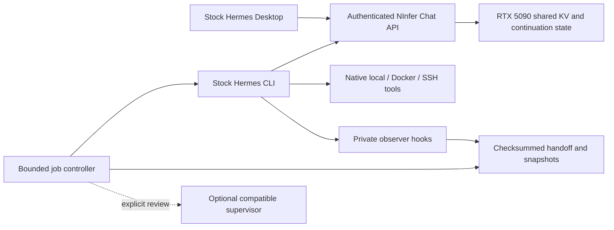

# Architecture

`ninfer.py` retains the original beginner setup, model/network selection, native
Desktop installation and service controls. `stack/config.py` and its manifest
own source/model/runtime settings; `provenance.py` verifies actual source,
image, CLI and artifacts. Compose runs the read-only inference service with
bounded logs and an optional one-shot downloader. Stock Hermes remains upstream.

`api.py`, `metrics.py`, `workloads.py` and `bench_agent.py` implement measured
multi-turn fixtures, actual Hermes mode, native timing and resource observations.
`storage.py`, `jobs.py`, `hermes_runner.py`, `execution.py` and the private plugin
add durable epochs around native sessions. `supervisor.py` is an optional review
boundary with no automatic remote calls. `documentation.py` projects the manifest
into README, the generated reference and the source pin in `.env.example`.

The inference cache is process-local performance state. The project ledger,
Hermes session database, repository and validation evidence are durable state.
Cache restoration is not a substitute for a checkpoint, and a checkpoint does
not roll back arbitrary external actions. See [jobs](jobs.md),
[security](security.md), [configuration](configuration.md) and
[performance](performance.md) for precise contracts.
