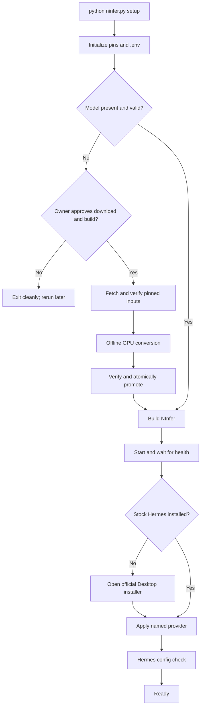

# Design overview

## Goal

Provide a small, reproducible RTX 5090 inference deployment that a normal stock
Hermes Desktop installation can use without containerizing or forking Hermes.
The desired first-run experience is one command:

```text
python ninfer.py setup
```

That command asks before the large source-model download and local conversion,
brings NInfer to a healthy state, then offers the official Desktop installation
and configures it.

## Non-goals

The project does not:

- ship a custom installer, GUI, or executable;
- build or redistribute Hermes Desktop;
- run Hermes, a web dashboard, or an SSH sandbox in Docker;
- replace the official Hermes updater or per-user data layout;
- make same-user native tool execution a security sandbox;
- support arbitrary GPUs, artifacts, or multi-GPU sharding.

## Design principles

### One deployment owner per component

Docker owns NInfer. The official Hermes installer owns Hermes Desktop. The
integration helper writes the provider boundary plus the documented
compression, turn-cap, and manual-approval defaults.
Independent ownership avoids coupling Hermes state migrations to a CUDA image
build and avoids maintaining a downstream Desktop package.

### Consent before expensive acquisition

The source checkpoint is approximately 55 GiB, requires approximately 90 GiB of
temporary working space, and produces a roughly 16.96 GiB artifact. Setup prints
those requirements before the uv-managed fetcher runs. Normal runtime builds,
CI, `up`, and Hermes installation do not implicitly acquire the model.

### Separate network and GPU build authority

The one-shot fetcher has network access but no GPU or model-output mount. The
one-shot converter has the selected GPU and model-output mount but no runtime
network. Pinned input revisions and frontend hashes cross between them through
ignored `model-build/` data. The long-running NInfer server sees only the final
model directory read-only.

### Healthy inference before client configuration

NInfer is started and its health check passes before Hermes is installed or
configured. This makes the saved endpoint immediately testable and keeps model
load failures separate from Hermes onboarding.

### Narrow, durable provider configuration

Hermes receives a named `providers.ninfer` entry with a `key_env` reference and
selects `custom:ninfer`. This preserves a durable provider identity in Desktop
sessions and avoids overwriting unrelated provider settings or a user's general
`OPENAI_API_KEY`.

### Loopback plus authentication

Compose binds NInfer to `127.0.0.1:${NINFER_HOST_PORT}` and the server requires
a random bearer key. Loopback prevents ordinary remote access; the key protects
against unauthorized local clients. Neither control is presented as protection
from a fully compromised user account.

### Honest native authority

Hermes runs as the current user. It can use every permission that user already
has. UAC governs elevation but does not prevent changes to the user's own
files. Hermes approval settings can reduce mistakes but are not an operating
system boundary. Stronger isolation requires a separate OS account, VM, or
other boundary outside this project's default design.

## First-run state machine



Every expensive or externally owned step is either explicit or resumable.
Setup never overwrites an unverified model, deletes the rollback artifact,
rotates the bearer key, or replaces unrelated Hermes configuration merely
because it was rerun.

## Runtime boundaries

The active runtime has two long-lived processes with separate lifecycles:

1. NInfer inside Docker, with the GPU, a read-only model mount, and one
   authenticated loopback port.
2. Stock Hermes Desktop and its local runtime outside Docker, with normal
   per-user state and tool authority.

The OpenAI-compatible API is the only integration contract. NInfer has no
knowledge of Hermes sessions or tools, and Hermes has no access to NInfer's C++
engine or Docker socket.

## Failure localization

The verifier checks boundaries in order:

1. configuration and pins;
2. Docker and GPU visibility;
3. model size, conversion provenance, and local checksum;
4. NInfer image and health;
5. authentication and model discovery;
6. direct generation;
7. native Hermes configuration and route, when installed.

This ordering avoids reporting a Hermes provider error when the actual problem
is a missing model or unhealthy server.

## Persistence

The built model, resumable source cache, and project `.env` remain on the host
across container recreation. Native Hermes state remains in the standard upstream-managed user
directory across NInfer rebuilds. The helper can reconstruct their connection
from the current project values without owning the rest of Hermes state.

## Operational tradeoffs

The design is simpler and more faithful to stock Hermes Desktop than the
previous all-Compose deployment. It also deliberately removes the former SSH
tool sandbox. Native tools now have direct same-user access, which improves
desktop integration but expands their filesystem reach. The documentation
therefore treats backups, source control, manual approvals, and optional OS
account separation as operational requirements rather than claiming container
isolation that no longer exists.

See [Architecture](architecture.md), [Security](security.md), and the
[historical ADRs](decisions/0001-separate-agent-and-inference-services.md) for
details.
